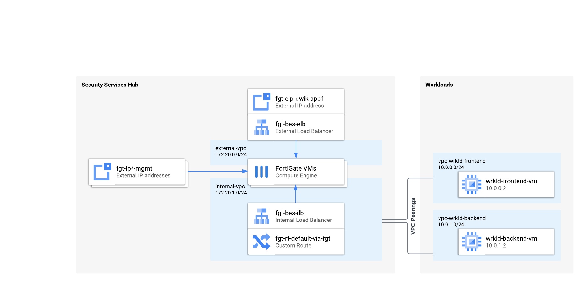
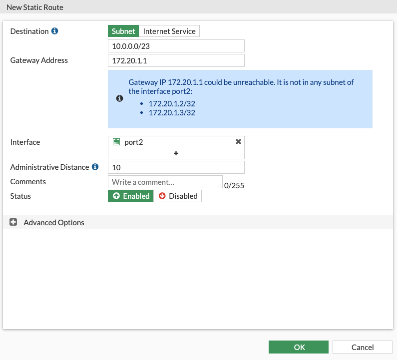
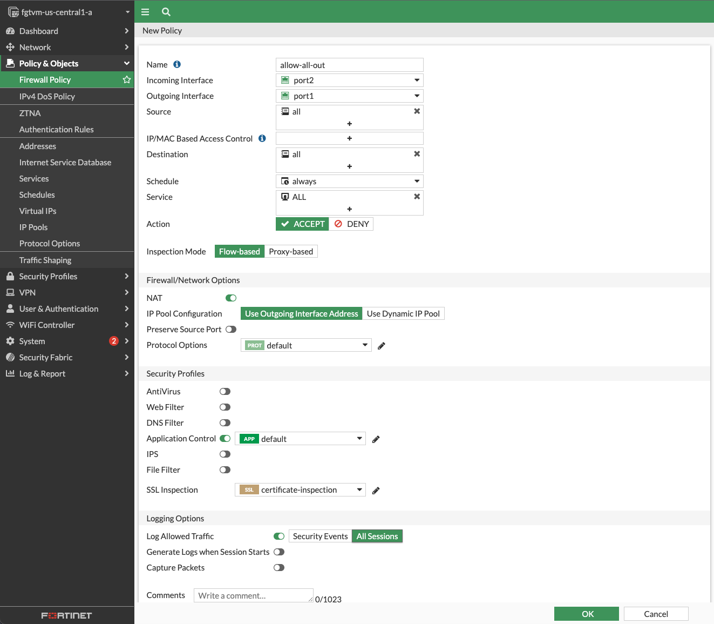
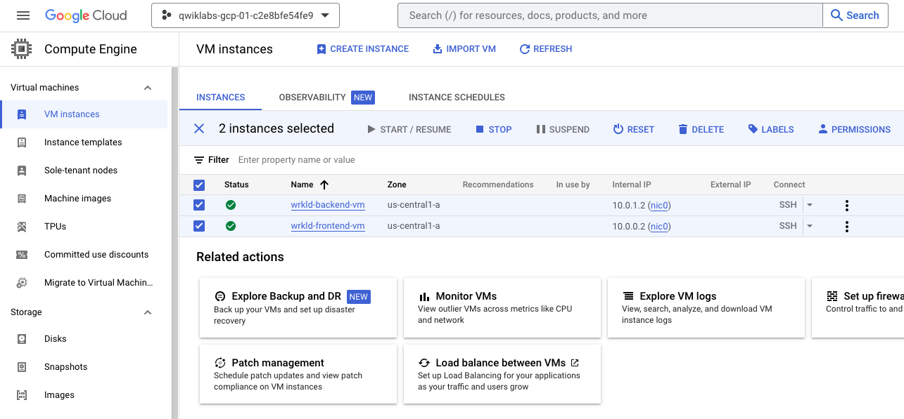
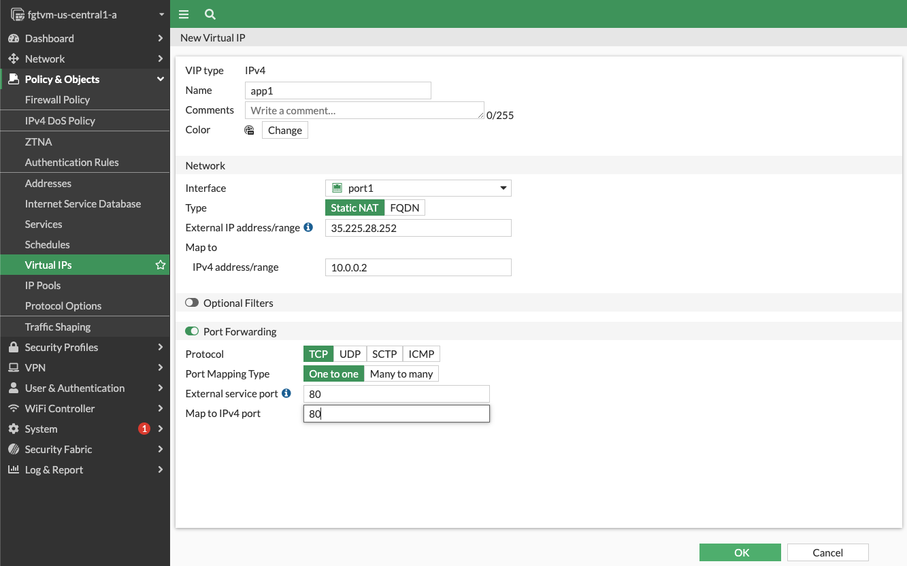
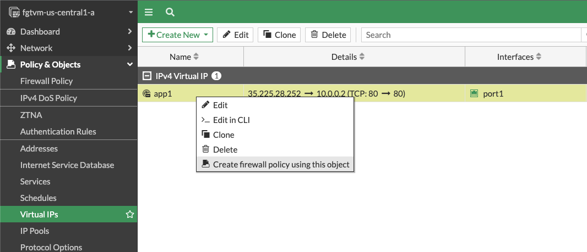
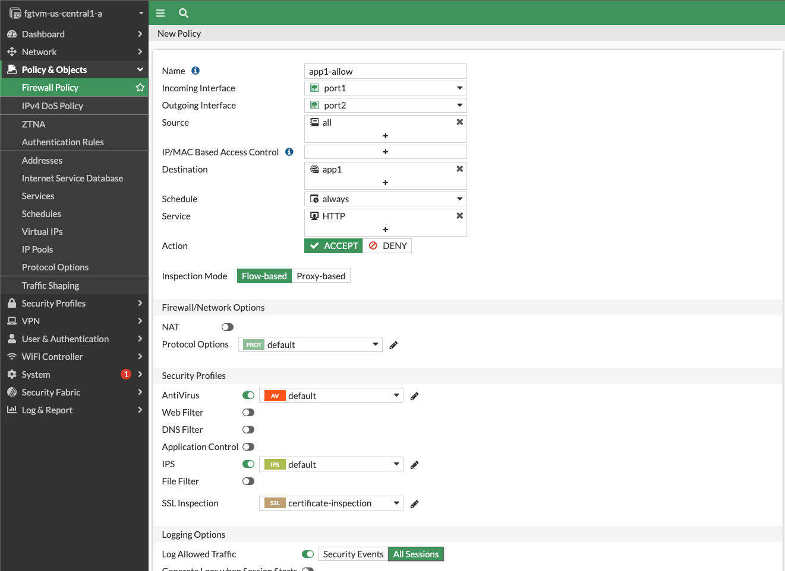
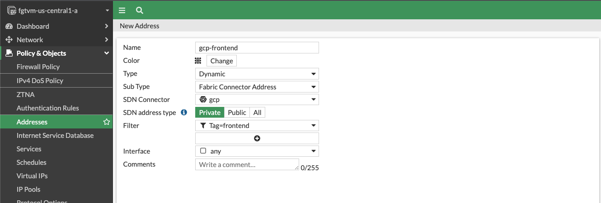
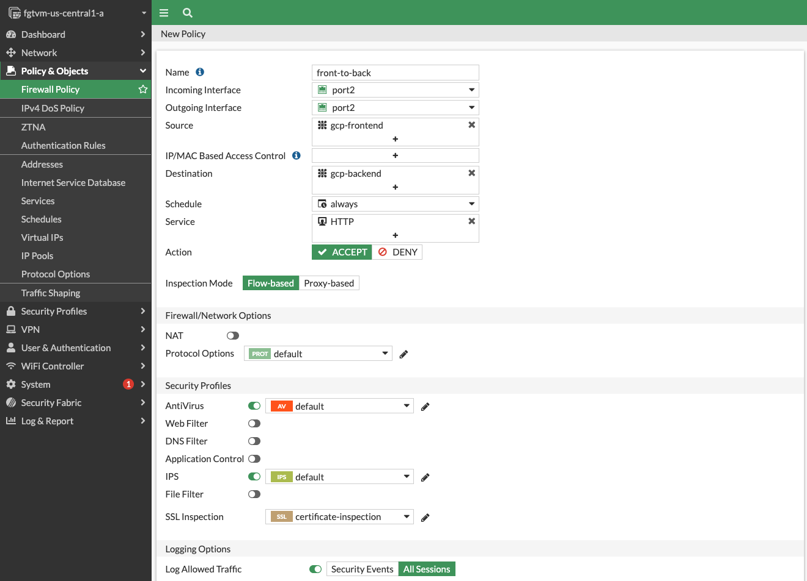

# FortiGate: Protecting Google Compute resources
## Overview
This lab is intended for network administrators implementing network traffic inspection in Google Cloud using FortiGate next-gen firewalls. You will learn the reference HA architecture and configure inbound, outbound and east-west traffic inspection using a FortiGate next-gen firewall cluster.

### Objectives
In this lab you will:

- Redirect inbound traffic to a frontend VM running in Google Cloud
- Secure outbound traffic from Google Cloud to Internet
- Secure east-west traffic between VMs running in Google Cloud

### Architecture
The lab starts with all cloud resources pre-deployed to match the FortiGate recommended architecture described below. Although all cloud resources are deployed and do not require any additional configuration, the FortiGates have only the following elements configured:

- [HA clustering](https://docs.fortinet.com/document/fortigate/7.2.0/cli-reference/23620/config-system-ha)
- [health probe responders](https://docs.fortinet.com/document/fortigate/7.2.0/cli-reference/122620/config-system-probe-response) (including ELB public IP as secondary IP on port1 interface)
- health probe static routes on port2
- [SDN connector](https://docs.fortinet.com/document/fortigate/7.2.0/cli-reference/87620/config-system-sdn-connector)
- licensing

You will configure all remaining FortiGate options necessary to make the setup work.

![[/fragments/fgt-ha-arch-summary]]

![[/fragments/before-you-start-multiproject-fgt]]

## Step 1: Initial lab configuration

### First connection and setting password
1. Open FortiGate management console {{{netsec_project.startup_script.fgt_mgmt_eip1 | URL }}} in your browser
2. Accept the initial password information
3. Log in using **admin** as username and {{{netsec_project.startup_script.fgt_password|FGT Password}}} as initial password (by default password is set to the primary VM instance id)
4. change password to your own and login again
5. you can skip dashboard configuration by clicking **Later**

### Configure FortiGate route to workload VPCs
While the cloud network infrastructure is pre-configured for this lab, you still need to adjust FortiGates routing configuration to indicate the route to workload VPCs (frontend and backend):

1. in FortiGate web console choose **Network** > **Static Routes** from left menu and click **Create New**
2. as destination provide CIDRs for both workload subnets. They can be aggregated to **10.0.0.0/23**
3. as Gateway Address provide local subnet gateway: **172.20.1.1**
4. as Interface select **port2**
5. ignore warning about possible gateway unreachability
6. click **OK** to add the route

## Step 2: outbound traffic
Workload servers are already deployed, but they cannot finish their bootstrapping without connectivity with Internet. In this step you will enable and inspect outbound traffic from workload VMs in peered networks to Internet.

<ql-warningbox>
While in this lab you will create a default rule allowing all traffic, in production environments it is recommended to create more granular settings. See other labs for managing outbound traffic.
</ql-warningbox>

1. Connect to primary FortiGate management (all configuration will be done on primary and replicated to secondary instance).
2. Create a firewall policy allowing all traffic from port2 to port1.
    - From the left menu select **Policy & Objects** > **Firewall Policy**
    - Click **Create New** button at the top
    - provide name for the new policy
    - as **Incoming interface** choose **port2** and for **Outgoing** **port1**
    - for **Source**, **Destination** and **Service** choose **all**
    - in **Security Profiles** enable **Application Control**
    - at the bottom change **Log Allowed Traffic** from **Security Events** to **All Sessions**
    - Save the new policy by clicking **OK**

3. Go to GCP console and switch to the {{{ workloads_project.project_id | Workloads }}} project.
4. Stop and start *frontend-vm* and *backend-vm* instances using **STOP** and **START/RESUME** buttons at the top of the instance details page in GCP console

5. In the FortiGate web console **Log & Report** > **Forwarding Logs** you should see traffic coming from 10.0.0.2 and 10.0.1.2 to multiple services including Ubuntu update.

<ql-activity-tracking step=1>
Verify you configured outbound connectivity correctly.
</ql-activity-tracking>

## Step 3: inbound traffic
In this step you will enable access from Internet to a web application frontend VM via FortiGate. In production environment you will use a farm of compute resources (VMs or serverless) behind an internal load balancer. For the sake of simplicity this lab uses single VMs to emulate frontend and backend farms.

In a cloud environment protected by a firewall no other VM is directly available from Internet. You can enforce this policy using Organization Policy constraints [`constraints/compute.vmExternalIpAccess`](https://cloud.google.com/resource-manager/docs/organization-policy/org-policy-constraints), but using constraints is beyond the scope of this lab.

1. Inspect your external load balancer. It has been already deployed with one frontend IP address.
    - in GCP web console make sure you have selected the {{{ netsec_project.project_id | Security Hub }}} project
    - go to **Network services** > **Load balancing**
    - find and open details of the load balancer with name starting by *fgtbes-elb*
    - make sure exactly one backend is indicated as healthy
    - write down the public IP address found in **Frontend** section - you will need it in next steps
2. Connect to primary FortiGate
3. Your frontend server is available at **10.0.0.2**. Create a Virtual IP (VIP) mapping ELB frontend IP to **10.0.0.2** and limit to port **80**:
    - in **Policy & Objects** open **VirtualIPs** and click **Create New (Virtual IP)** button at the top
    - name your VIP
    - as **Interface** select **port1**
    - in **External IP address/range** field provide ELB public IP you noted earlier
    - in **Map to** enter the frontend server private IP: **10.0.0.2**
    - enable **Port Forwarding**
    - as both **External service port** and **Map to IPv4 port** provide the HTTP port number: **80**
    - confirm the configuration of new Virtual IP by clicking **OK**

4. Right-click on the VIP and select **Create firewall policy using this object** from context menu

5. Fill in missing firewall policy fields:
    - provide a firewall policy name
    - as **Outgoing interface** select **port2**
    - as **Source** select **all**
    - as **Service** select **HTTP**
    - disable **NAT**
    - in **Security Profiles** enable **IPS**
    - in **Log Allowed Traffic** select **All Sessions**

5. In your browser try connecting to ELB public IP over HTTP protocol (http://ELB_ADDRESS/). After few seconds you should receive a *504 Gateway Time-out* message indicating you have reached the frontend proxy server but the connection between frontend and backend server failed.

<ql-activity-tracking step=2>
Verify you configured inbound connectivity correctly.
</ql-activity-tracking>

## Step 4:  east-west connections
Some applications might require traffic inspection between application tiers (eg. using IPS - Intrusion Prevention System). Note that in GCP you must deploy different application tiers into different VPC networks. Due to the nature of Google Cloud networking only traffic leaving a VPC can be redirected to a network virtual appliance for inspection.

In this step you will enable secure connectivity between VMs in frontend and backend VPC networks. You will use Fortinet Fabric Connector to build a firewall rule based on metadata rather than using static CIDRs.

1. Connect to primary FortiGate
2. use left menu to navigate to **Policy & Objects** > **Addresses** and create dynamic addr3esses for frontend and backend network tags:
    - use **Create New** button to create a new address
    - provide **gcp-frontend** as name
    - in **Type** select **Dynamic**
    - SDN Connector for GCP was already pre-configured as *gcp*. Select it in the **SDN Connector** field
    - in **Filter** field select **Tag=frontend**
    - save new address by clicking **OK**
    - repeat steps to create new address for the *backend* network tag

3. create a firewall policy allowing traffic from frontend to backend with port2 as both source and destination interface
    - in **Policy & Objects** > **Firewall Policy** click **Create New** button at the top
    - name the policy
    - as both **Incoming Interface** and **Outgoing Interface** select **port2** as both VM instances are peered with the internal VPC of the firewall
    - as **Source** select **gcp-frontend**
    - as **Destination** select **gcp-backend**
    - as **Service** select **HTTP**
    - disable **NAT**
    - in **Security Profiles** enable **Antivirus** and **IPS**
    - enable logging of all sessions
    - save the policy by clicking **OK**

4. use your web browser to connect to ELB public IP address over HTTP protocol. You should receive a **It works!** message (if you see the default nginx page or 502 error - wait few seconds and refresh the page).
5. Click **Try getting EICAR** button to attempt downloading a harmless EICAR test virus file. Your attempt will be blocked by FortiGate. You can verify details about detected incident in FortiGate **Forward Traffic** log.

<ql-activity-tracking step=3>
Verify east-west connectivity between frontend and backend.
</ql-activity-tracking>

## Congratulations

Congratulations! You have completed this lab and learned how to use FortiGates to protect inbound and outbound traffic between the Internet and Google Cloud as well as inspect traffic between VMs in different VPC Networks. Click red **End Lab** button at the top left to close the lab.
